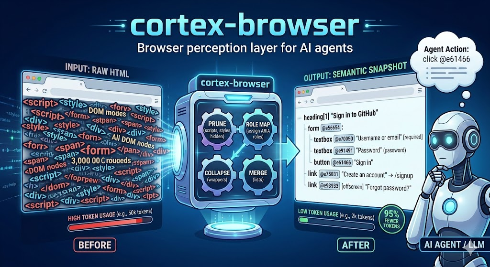

# cortex-browser

[](https://crates.io/crates/cortex-browser)
[](LICENSE)



Compact browser perception layer for AI agents. Converts web pages into token-efficient semantic snapshots that LLMs can reason about.

Takes raw HTML (thousands of DOM nodes, scripts, styles) and produces a clean, indented accessibility tree with stable ref IDs for interaction.

## Why?

LLMs are bad at raw HTML. A typical web page has thousands of DOM nodes - scripts, style blocks, deeply nested divs, invisible elements - none of which help an agent understand what's on the page or how to interact with it. Feeding raw HTML to an LLM wastes tokens and confuses the model.

cortex-browser solves this by converting the DOM into a compact, structured accessibility tree that preserves the semantics an agent actually needs: what elements are on the page, what they do, and how to interact with them. The result is typically **90-95% fewer tokens** than raw HTML, with no loss of actionable information.

## Example

Given a login page, cortex-browser produces:

```
page: "GitHub - Sign In" [github.com]
viewport: 0-900 of 1200px
---
heading[1] "Sign in to GitHub"
form @e56654:
  textbox @e70050 "Username or email address" [required]
  textbox @e91491 "Password" (password)
  checkbox @e77747 "Keep me signed in" [unchecked]
  button @e61466 "Sign in"
link @e75031 "Create an account" -> /signup
link @e93933 [offscreen] "Forgot password?" -> /password_reset
```

Interactive elements get `@eN` refs. The agent clicks by ref (`click @e61466`), types by ref (`type @e70050 "user@example.com"`), and reads structured output instead of raw HTML.

## Features

- **4-stage DOM pipeline**: prune (scripts, hidden, aria-hidden) -> role mapping (ARIA semantics) -> wrapper collapse (meaningless divs) -> sibling merging (long lists)
- **Stable ref IDs**: Hash-based refs survive DOM mutations. An element with `id="submit"` keeps the same ref across snapshots.
- **Multi-tab support**: Open, switch, list, and close tabs. Each tab has independent state.
- **Viewport-aware snapshots**: Shows scroll position, marks off-screen elements `[offscreen]`, supports scroll_down/scroll_up/scroll_to_ref.
- **Page diff**: After actions, get a compact diff instead of a full re-snapshot (`return_diff: true` or standalone `page_diff` tool).
- **Task context filtering**: Focus snapshots on relevant regions (e.g., only form elements matching "login").
- **Screenshot + annotations**: Capture PNG screenshots of the current page. Optionally overlay interactive elements with red borders and `@eN` labels for visual debugging. Supports viewport and full-page modes.
- **Auth state persistence**: Save and restore browser cookies as named profiles. Login sessions survive browser restarts — save once, restore anywhere.
- **Structured data extraction**: Pull tables, lists, and objects from pages as JSON using a JSON Schema — no LLM needed.
- **Action recording & replay**: Record browser action sequences and replay them deterministically using stored element locators.
- **MCP server**: Runs as a Model Context Protocol server over stdio or HTTP for agent integration.
- **Incremental re-snapshots**: DOM mutation observer skips re-processing when nothing changed.

## Download

Pre-built binaries for macOS, Linux, and Windows are available on the [Releases](https://github.com/igor-silveira/cortex-browser/releases) page.

Download the latest release for your platform and add it to your `PATH`.

## Getting Started

### Prerequisites

- **Rust 1.70+** - [install via rustup](https://rustup.rs/)
- **Chrome/Chromium** - needed for live URL snapshots and MCP mode (not required for local HTML files)

### 1. Install

```sh
# Clone and build
git clone https://github.com/igorsilveira/cortex-browser.git && cd cortex-browser
make install    # installs to ~/.cargo/bin

# Or build without installing
make release    # binary at target/release/cortex-browser
```

### 2. Try it on a local HTML file

No Chrome needed for local files:

```sh
cortex-browser snapshot page.html
cortex-browser snapshot page.html -f json    # JSON output
cat page.html | cortex-browser snapshot -    # read from stdin
```

### 3. Snapshot a live URL

Start Chrome with remote debugging enabled:

```sh
# macOS
/Applications/Google\ Chrome.app/Contents/MacOS/Google\ Chrome --remote-debugging-port=9222

# Linux
google-chrome --remote-debugging-port=9222
```

Then snapshot any page:

```sh
cortex-browser snapshot https://example.com --port 9222
```

Or let cortex-browser launch a headless Chrome for you:

```sh
cortex-browser snapshot https://example.com --launch
```

### 4. Run as an MCP server

This is the main use case - cortex-browser acts as a tool server that AI agents connect to via the [Model Context Protocol](https://modelcontextprotocol.io/).

Two transport modes are available:

#### Option A: Stdio transport (default)

The agent framework starts cortex-browser as a subprocess and communicates over stdin/stdout using JSON-RPC. This is the standard approach for local MCP integrations.

```sh
cortex-browser mcp --launch        # launch headless Chrome automatically
cortex-browser mcp --port 9222     # connect to an already-running Chrome
```

#### Option B: HTTP transport (Streamable HTTP + SSE)

cortex-browser runs as a standalone HTTP server. Agents connect over HTTP using the [MCP Streamable HTTP transport](https://modelcontextprotocol.io/specification/2025-03-26/basic/transports#streamable-http). This is useful for remote deployments, shared servers, and clients that support HTTP-based MCP.

```sh
cortex-browser mcp-http --launch                          # localhost:8080
cortex-browser mcp-http --launch --http-port 3000         # custom port
cortex-browser mcp-http --launch --host 0.0.0.0           # expose to network
cortex-browser mcp-http --port 9222 --http-port 3000      # connect to existing Chrome
```

The MCP endpoint is served at `http://<host>:<http-port>/mcp`. The server supports stateful sessions via SSE, so clients can maintain persistent connections with `GET` and receive streaming updates.

#### Connecting to Claude Desktop

Add to your `claude_desktop_config.json` (stdio):

```json
{
  "mcpServers": {
    "cortex-browser": {
      "command": "cortex-browser",
      "args": ["mcp", "--launch"]
    }
  }
}
```

#### Connecting to Claude Code

Add to your `.mcp.json` (stdio):

```json
{
  "mcpServers": {
    "cortex-browser": {
      "command": "cortex-browser",
      "args": ["mcp", "--launch"]
    }
  }
}
```

Or connect to a running HTTP server:

```json
{
  "mcpServers": {
    "cortex-browser": {
      "type": "streamable-http",
      "url": "http://localhost:8080/mcp"
    }
  }
}
```

#### Connecting to any MCP-compatible agent

**Stdio**: Start the process with `cortex-browser mcp --launch` and wire stdin/stdout to your MCP client transport.

**HTTP**: Start the server with `cortex-browser mcp-http --launch`, then point your MCP client at `http://localhost:8080/mcp`. The client should:
1. `POST` JSON-RPC messages with headers `Content-Type: application/json` and `Accept: application/json, text/event-stream`
2. Read the `mcp-session-id` header from the response
3. Include `mcp-session-id` in subsequent requests
4. Optionally `GET` with `Accept: text/event-stream` to open an SSE stream for server-initiated messages

## Usage Guide

### Reading snapshots

Snapshots are compact accessibility trees. Each line is a node with its ARIA role, optional ref, name, and attributes:

```
heading[1] "Sign in to GitHub"          ← h1 heading, not interactive
textbox @e70050 "Email" (email)         ← input with ref 70050, type=email
button @e61466 "Sign in"               ← clickable, use ref 61466
link @e93933 [offscreen] "Help" -> /h   ← off-screen, has href
```

- `@eN` - stable ref ID for interaction. Only interactive elements get refs.
- `[offscreen]` - element is outside the current viewport.
- `(type)` - input type when relevant (password, email, tel, etc.).
- `-> url` - link destination.
- `[checked]` / `[unchecked]` - checkbox/radio state.
- `[required]` / `[disabled]` - form control attributes.

### Interacting with pages (MCP tools)

Once connected via MCP, the agent has access to these tools:

**Navigation & snapshots:**

| Tool | Description |
|------|-------------|
| `navigate` | Open a URL and return the page snapshot |
| `snapshot` | Re-read the current page (returns cached version if DOM is unchanged) |
| `page_diff` | Compare current page to previous snapshot, showing only changes |

**Element interaction** (use the `@eN` ref number from the snapshot):

| Tool | Parameters | Description |
|------|-----------|-------------|
| `click` | `ref`, `return_diff?` | Click an element |
| `type_text` | `ref`, `text`, `return_diff?` | Type into an input field |
| `select_option` | `ref`, `value`, `return_diff?` | Pick a dropdown option |

Setting `return_diff: true` on any interaction returns a compact diff instead of a full snapshot.

**Scrolling:**

| Tool | Description |
|------|-------------|
| `scroll_down` / `scroll_up` | Scroll by one viewport height |
| `scroll_to_ref` | Scroll a specific element into view |

**Multi-tab management:**

| Tool | Description |
|------|-------------|
| `open_tab` | Open a URL in a new tab |
| `list_tabs` | List all tabs with IDs and URLs |
| `switch_tab` | Switch to a tab by ID |
| `close_tab` | Close a tab by ID |

**Focusing & filtering:**

| Tool | Description |
|------|-------------|
| `set_task_context` | Focus subsequent snapshots on task-relevant content (persists until cleared) |
| `clear_task_context` | Remove the filter, show full page again |
| `focused_snapshot` | One-time filtered snapshot without changing persistent context |
| `wait_for_changes` | Block until the DOM changes (useful after async actions) |

**Screenshot:**

| Tool | Parameters | Description |
|------|-----------|-------------|
| `screenshot` | `full_page?`, `annotate?` | Capture a PNG screenshot. `annotate` overlays `@eN` labels on interactive elements |

**Auth state persistence:**

| Tool | Parameters | Description |
|------|-----------|-------------|
| `get_cookies` | | List cookies for the current page |
| `save_auth` | `profile` | Save current cookies to disk as a named profile |
| `restore_auth` | `profile`, `domain?` | Inject saved cookies back into the browser |
| `list_auth` | `domain?` | List saved auth profiles |
| `delete_auth` | `profile`, `domain?` | Delete a saved profile |

**Structured data extraction:**

| Tool | Parameters | Description |
|------|-----------|-------------|
| `extract` | `schema`, `selector?` | Extract structured JSON from the page using a JSON Schema |

**Recording & replay:**

| Tool | Parameters | Description |
|------|-----------|-------------|
| `start_recording` | `name`, `description?` | Start capturing browser actions |
| `stop_recording` | | Stop and save the recording to disk |
| `replay_recording` | `name`, `domain?` | Replay a saved recording deterministically |
| `list_recordings` | `domain?` | List saved recordings |
| `delete_recording` | `name`, `domain?` | Delete a saved recording |

### Example agent workflow

A typical agent session looks like this:

```
Agent: navigate("https://github.com/login")
  → receives page snapshot with form fields

Agent: type_text(ref=70050, text="user@example.com")
  → receives updated snapshot

Agent: type_text(ref=91491, text="mypassword")
  → receives updated snapshot

Agent: click(ref=61466, return_diff=true)
  → receives compact diff showing the page transition

Agent: wait_for_changes(timeout_ms=3000)
  → receives snapshot of the logged-in dashboard
```

### Reducing token usage

For large pages, use task context to filter snapshots:

```
Agent: set_task_context(task="fill login form", focus_roles=["textbox", "button"], interactive_only=true)
  → subsequent snapshots show only interactive elements

Agent: snapshot()
  → much smaller output, focused on form controls

Agent: clear_task_context()
  → back to full page snapshots
```

Or use `focused_snapshot` for a one-time filtered view without changing the persistent context.

Use `return_diff: true` on interactions and `page_diff` to see only what changed instead of re-reading the entire page.

## Token Comparison

A bundled script measures the token reduction between raw HTML and cortex-browser output:

```sh
# Run against the built-in test fixtures
make token-compare

# Run against specific files or URLs
python3 scripts/token-compare.py page.html https://example.com
```

By default the script runs against the test fixtures and a live fetch of wikipedia.org:

```
Source                                  Raw HTML       Cortex    Ratio    Saved
───────────────────────────────────────────────────────────────────────────────
blog.html                                   5.0k         1.0k    0.21x    79.1%
dashboard.html                              7.5k          644    0.09x    91.4%
ecommerce.html                              9.4k         1.2k    0.13x    87.4%
spa_app.html                                4.5k          455    0.10x    89.8%
www.wikipedia.org                          48.3k         2.0k    0.04x    95.9%
───────────────────────────────────────────────────────────────────────────────
TOTAL                                      74.6k         5.3k    0.07x    92.9%
```

Wikipedia's 48k tokens of raw HTML compress to ~2k tokens - a **95.9% reduction**.

For accurate token counts, install `tiktoken`:

```sh
pip install tiktoken
```

Without it the script uses an approximate word/symbol counter.

## Logging

cortex-browser uses structured logging via `tracing`. Logs go to stderr so they don't interfere with stdout output or the MCP protocol.

Control the log level with the `RUST_LOG` environment variable:

```sh
# Default (info) - tool invocations, navigation, tab operations
cortex-browser mcp --launch

# Debug - adds pipeline stats, cache hits/misses, DOM mutation counts
RUST_LOG=debug cortex-browser mcp --launch

# Debug for cortex-browser only (avoids noisy html5ever/selectors output)
RUST_LOG=cortex_browser=debug cortex-browser mcp --launch

# Quiet - only warnings and errors
RUST_LOG=warn cortex-browser snapshot page.html
```

## Build

```sh
make build          # debug build
make release        # optimized build
make test           # run all tests
make lint           # clippy
make install        # install to ~/.cargo/bin
```

## Project Structure

```
src/
  main.rs        CLI entry point (snapshot + mcp subcommands)
  lib.rs         Public modules
  pipeline.rs    4-stage DOM processing pipeline
  dom.rs         Semantic tree types (PageSnapshot, SemanticNode, AriaRole)
  serialize.rs   Compact text serialization for LLM consumption
  diff.rs        Page diff algorithm (added/removed/modified)
  extract.rs     Schema-based structured data extraction
  hints.rs       Task context filtering and relevance scoring
  mutation.rs    DOM mutation observer + viewport JS
  recording.rs   Action recording types and RecordingStore
  auth.rs        Cookie persistence types and AuthStore
  mcp.rs         MCP server with multi-tab state management
  browser.rs     Chrome CDP connection and page fetching
tests/
  integration.rs Integration tests
  fixtures/      HTML fixtures (blog, dashboard, ecommerce, SPA)
```

## Architecture

cortex-browser processes pages through a 4-stage pipeline:

```
Raw HTML
  → Prune        Remove scripts, styles, hidden elements, aria-hidden
  → Role map     Assign ARIA semantics (button, textbox, link, heading, etc.)
  → Collapse     Flatten meaningless wrapper divs
  → Merge        Combine long sibling lists into summaries
Semantic snapshot
```

Each stage reduces noise while preserving the information an agent needs to understand and interact with the page.

## Contributing

Contributions are welcome! Please:

1. Fork the repo and create a feature branch
2. Make sure tests pass: `make test`
3. Run the linter: `make lint`
4. Submit a pull request

For bugs and feature requests, [open an issue](https://github.com/igorsilveira/cortex-browser/issues).

## License

This project is licensed under the MIT License - see the [LICENSE](LICENSE) file for details.
